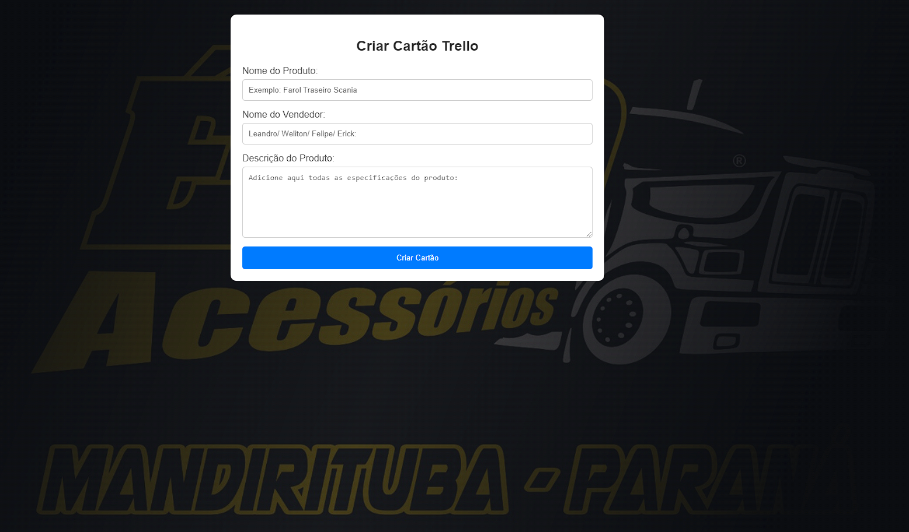

# Compras Eto

## Descrição
O Compras Eto é um sistema web desenvolvido para melhorar o processo de organização de cotações e orçamentos para o setor de compras de uma loja. Este projeto foi criado para resolver o problema de gerenciamento manual das cotações e orçamentos feitos por meio de aplicativos de mensagens.

## Funcionalidades Principais
- Interface intuitiva para inserção de cotações e orçamentos.
- Integração com a API do Trello para adicionar cotações e orçamentos em quadros específicos.

## Tecnologias Utilizadas
- HTML5
- CSS3
- JavaScript
- API do Trello (para integração e gerenciamento dos quadros)
- Git (para controle de versão)

## Autor
Angelo Hervis
- GitHub: [AngeloHervis](https://github.com/AngeloHervis)
- LinkedIn: [Angelo Hervis](https://www.linkedin.com/in/angelo-hervis/)
